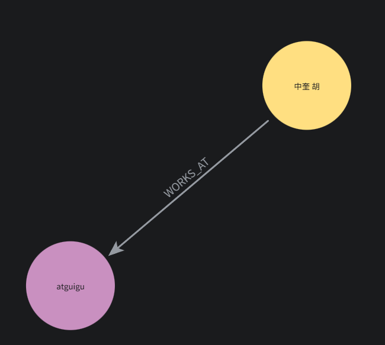
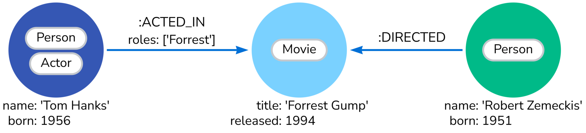

# Neo4j 完整开发指南：从零到实战
---

## 1、 Neo4j

### 1.1 Neo4j 概述

**Neo4j** 是世界领先的**图数据库**，专门用于存储和查询高度关联的数据。

### 1.2 为什么需要图数据库？

- 传统关系型数据库（MySQL）处理"关系"时需要大量 JOIN 操作，当关系层级变深（比如"朋友的朋友的朋友推荐了什么商品"），性能会急剧下降。
- 图数据库天然为"关系"而生。

- **核心思维转变：** 关系型数据库以"表"为中心思考，图数据库以"关系"为中心思考。

### 1.3 典型应用场景

- **社交网络**：好友关系、推荐系统
- **知识图谱**：实体关系、语义搜索
- **欺诈检测**：交易关系、异常模式识别
- **推荐引擎**：用户-商品关联
- **网络与 IT 运维**：依赖关系、影响分析

## 2、核心概念

### 2.1 四个核心概念概览

```
节点 (Node)          —— 实体/事物，类比表中的一行记录
标签 (Label)         —— 节点的分类，类比表名
关系 (Relationship)  —— 节点之间的连接，有方向、有类型
属性 (Property)      —— 节点或关系上的键值对数据，类比字段
```

用图来理解：



```Cypher
CREATE (p:Person {name: "sjf", title: "Developer"})-[r:WORKS_AT]->(c:Company {name: "TechCorp", industry: "IT"})
RETURN p, r, c
```



```Cypher
CREATE (p:Person {name: "sjf", title: "Developer"})-[r:WORKS_AT]->(c:Company {name: "TechCorp", industry: "IT"})
RETURN p, r, c
```

### 2.2 与关系型数据库概念对照

| 关系型数据库 | 图数据库 |
|---|---|
| 表 (Table) | 标签 (Label) |
| 行 (Row) | 节点 (Node) |
| 列 (Column) | 属性 (Property) |
| 外键 (FK) | 关系 (Relationship) |
| JOIN | 模式匹配 (Pattern Matching) |

---

### 2.3 核心概念详解

#### 2.3.1 节点 (Node)

- 图中的基本实体，用 **`( )`** 表示。
- 示例：`(人物)`、`(电影)`、`(公司)`
- 每个节点可以包含**零个或多个标签**，以及**零个或多个属性**。

#### 2.3.2 标签 (Label)

- 用于对节点**分类标记**，一个节点可拥有多个标签。
- Cypher 示例：

```cypher
(:Person)           -- 单个标签
(:Person:Actor)     -- 多个标签
```

#### 2.3.3 关系 (Relationship)

- 连接两个节点的**有向、有类型**的边，用 **`[:TYPE]`** 表示。
- 关系**必须**有方向（查询时可忽略方向）且可以携带属性
- 示例：

```cypher
(张三)-[:KNOWS]->(李四)
(演员)-[:ACTED_IN {roles: ["主角"]}]->(电影)
```

#### 2.3.4 属性 (Property)

- 节点或关系上的**键值对**，用于描述特征。
- 支持数值、字符串、布尔、列表等类型。
- 示例：

```cypher
(:Person {name: "张三", age: 28})
[:KNOWS {since: 2020}]
```

#### 2.3.5 图结构示意

```
     ┌─────────────┐
     │  Person     │
     │ name: "张三" │
     │ age: 28     │
     └──────┬──────┘
            │
       [:KNOWS]
       since: 2020
            │
            ▼
     ┌─────────────┐
     │  Person     │
     │ name: "李四" │
     │ age: 25     │
     └─────────────┘
```

---

## 3、部署 Neo4j

### 3.1 Docker 部署（推荐）

```bash
# 启动容器
docker run -d \
  --name neo4j \
  -p 7474:7474 \
  -p 7687:7687 \
  -e NEO4J_AUTH=neo4j/your_password123 \
  -v $HOME/neo4j/data:/data \
  -v $HOME/neo4j/logs:/logs \
  -v $HOME/neo4j/plugins:/plugins \
  neo4j:2026.01.3
```

**端口说明：**

- `7474`：浏览器可视化界面（HTTP）
- `7687`：Bolt 协议端口（应用程序连接用）

### 3.2 Docker Compose部署

```sh
services:
  neo4j:
    image: neo4j:latest
    volumes:
        - /$HOME/neo4j/logs:/logs
        - /$HOME/neo4j/config:/config
        - /$HOME/neo4j/data:/data
        - /$HOME/neo4j/plugins:/plugins
    environment:
        - NEO4J_AUTH=neo4j/your_password
    ports:
      - "7474:7474"
      - "7687:7687"
    restart: always
```

### 3.3 Neo4j Desktop 安装步骤

1. 访问 https://neo4j.com/download/
2. 下载 Neo4j Desktop
3. 安装并启动
4. 创建新项目 → 添加数据库 → 启动

> 推荐安装桌面版，方便操作。

### 3.4 Neo4j Browser 使用

启动后访问：**http://localhost:7474**，输入用户名 `neo4j` 和你设置的密码即可进入。

#### 3.4.1 界面介绍

```
┌─────────────────────────────────────────────┐
│  Neo4j Browser                              │
├─────────────────────────────────────────────┤
│  $ neo4j> [输入 Cypher 查询]                 │
├─────────────────────────────────────────────┤
│                                             │
│     [查询结果可视化展示区域]                   │ 
│                                             │
```

#### 3.4.2 界面核心区域

- **顶部编辑栏：** 输入 Cypher 语句，按 `Ctrl+Enter` 执行
- **左侧面板：** 数据库信息、已保存的查询、收藏
- **中央画布：** 查询结果以图形/表格/文本形式展示

#### 3.4.3 常用命令

```cypher
:help               — 帮助
:clear              — 清屏
:play start         — 入门教程
:play cypher        — Cypher 教程
:schema             — 查看数据库 schema（标签、关系类型、属性）
:sysinfo            — 系统信息
:param name => '张三' — 设置参数
:params             — 查看所有参数
```


## 4、Cypher 语法

Cypher 是 Neo4j 的查询语言，语法直观，核心思想是 **用 ASCII 艺术画出你想要的图模式**。

### 3.1 基础语法（CRUD）操作

（Create）子句

#### 3.1.1 创建节点

**语法规范**:

```cypher
-- 传统：CREATE
// 1.创建空节点（最简形式）
CREATE ()           -- 匿名节点 
CREATE (n)          -- 带变量名，便于后续操作

// 2.创建带标签的节点
CREATE (:Person)    -- 指定标签，无属性

// 3.创建带标签和属性的节点
CREATE (:Person {name: '张三', age: 28})
                  
// 4. 创建多个节点（批量）
CREATE (a:Person {name: '李四'}),(:Person {name: '王五', age: 25}),(b:City {name: '北京'}) 

// 5. 创建节点并返回
CREATE (p:Person {name: '赵六', age: 30})
RETURN p

// 6. 创建节点带多标签
CREATE (:Person:Actor {name: '成龙'})                  
CREATE (:Person&Actor {name: '洪金宝'})         
```


#### 3.1.2 创建关系

**语法规范**:

```cypher
// 1. 匹配已有节点，创建关系带属性（最常用）
MATCH (a:Person {name: '张三'}), (b:Person {name: '李四'})                                  -- 匹配已有节点
CREATE (a)-[:FRIEND {since: 2019}]->(b)

// 2. 创建节点的同时创建关系
CREATE (a:Person {name: '小红'})-[:WORKS_AT {role: '工程师'}]->(c:Company {name: '阿里巴巴'}) -- 创建新节点

// 3. 创建关系并返回
MATCH (a:Person {name: '张三'}), (b:Person {name: '李四'})
CREATE (a)-[:KNOWS]->(b)
RETURN a, b                                                                                 -- 返回节点

// 4. 创建多个关系
CREATE (a:Person {name: '王五'})-[:LIKES]->(:Movie {title: '盗梦空间'}),
       (a)-[:LIKES]->(:Movie {title: '星际穿越'})

```

**注意事项：**

> - **关系必须有方向**（箭头表示）和**类型**（如 `:FRIEND`），但在查询时可以使用 `-[:TYPE]-` 忽略方向。
> - 关系**可以携带属性**（如 `{since: 2019}`），属性格式与节点属性相同。

#### 3.1.3 查询

（MATCH + RETURN）子句

**语法规范：**

```cypher
-- 1. 节点查询
// 1.1 查询所有节点
MATCH (n) RETURN n

// 1.2 查询带标签的节点
MATCH (p:Person) RETURN p

// 1.3 查询节点并返回属性
MATCH (p:Person) RETURN p.name, p.age

-- 2. 条件查询（WHERE）
// 2.1 单一条件
MATCH (p:Person) WHERE p.age > 25 RETURN p.name, p.age

// 2.2 多条件组合
MATCH (p:Person) WHERE p.age > 25 AND p.city = '北京' RETURN p

// 2.3 使用属性值作为条件
MATCH (p:Person {name: '张三'}) RETURN p

-- 3. 关系查询
// 3.1 有向关系查询
MATCH (a:Person)-[:FRIEND]->(b:Person) RETURN a.name, b.name

// 3.2 忽略方向（双向）
MATCH (a:Person)-[:FRIEND]-(b:Person) WHERE a.name = '张三' RETURN b.name

// 3.3 查询关系属性
MATCH (a:Person)-[r:FRIEND]->(b:Person) RETURN a.name, r.since, b.name

-- 4. 路径查询 （复杂）
-- 传统写法--                  
// 4.1 固定深度（2跳）
MATCH (a:Person {name: '张三'})-[:FRIEND*2]->(fof:Person)
RETURN fof.name AS friendOfFriend

-- GQL 变换写法 A：量化路径模式 (通用) 
把“找朋友”这个动作 (()-[:FRIEND]->()) 包起来重复 2 次。
MATCH (a:Person {name: '张三'}) 
      (()-[:FRIEND]->()){2} 
      (fof:Person)
RETURN fof.name AS friendOfFriend

-- GQL 变换写法 B：量化关系 (推荐，最简洁) 
直接在箭头后面加量词 {2}，这种写法专门用来替代旧版的 *2。
MATCH (a:Person {name: '张三'})-[:FRIEND]->{2}(fof:Person)
RETURN fof.name AS friendOfFriend

// 4.2 可变深度（1～3跳）
MATCH (a:Person {name: '张三'})-[:FRIEND*1..3]->(distant:Person)
RETURN distant.name

-- GQL 变换写法 A：量化路径模式 (通用)
MATCH (a:Person {name: '张三'}) 
      (()-[:FRIEND]->()){1,3} 
      (distant:Person)
RETURN distant.name
-- GQL 变换写法 B：量化关系 (推荐) 
MATCH (a:Person {name: '张三'})-[:FRIEND]->{1,3}(distant:Person)
RETURN distant.name
    
// 4.3 所有路径
MATCH path = (a:Person {name: '张三'})-[:FRIEND*1..3]->(distant:Person)
RETURN path

// 4.4 最短路径
MATCH p = shortestPath((a:Person {name: '张三'})-[:FRIEND*..10]->(b:Person {name: '李四'}))
RETURN p

                                                                   
-- 5. 返回结果处理
// 5.1 别名
MATCH (p:Person) RETURN p.name AS 姓名, p.age AS 年龄

// 5.2 去重
MATCH (p:Person)-[:ACTED_IN]->(:Movie) RETURN DISTINCT p.name

// 5.3 排序
MATCH (p:Person) RETURN p.name, p.age ORDER BY p.age DESC

// 5.4 分页（LIMIT 与 SKIP）
MATCH (p:Person) RETURN p.name, p.age ORDER BY p.age DESC LIMIT 5
MATCH (p:Person) RETURN p.name, p.age ORDER BY p.age DESC SKIP 5 LIMIT 5 
```

**注意事项**：

> - **MATCH 与 RETURN**：`MATCH` 定义要查找的图模式，`RETURN` 定义返回的内容，两者通常成对使用。
> - **变量**：节点和关系后跟的变量名（如 `p`、`r`、`path`）只在当前查询内有效，可自由命名。
> - **关系方向**：查询时可以使用 `-[:TYPE]-` 忽略方向，但存储时必须明确方向。
> - **路径长度**：`*n` 表示固定 n 跳；`*m..n` 表示 m 到 n 跳（含边界）；`*` 表示任意深度（需谨慎使用）。
> - **无匹配结果**：`MATCH` 若未找到匹配模式，返回空结果集，不会报错。如需保留可能缺失的部分，使用 `OPTIONAL MATCH`。
> - **量化路径模式**通过提取重复部分 + 量化符，优雅地处理可变长度路径

#### 3.1.4 更新

（SET）子句

**语法规范**：

```cypher
-- 1. 更新节点属性
// 1.1 直接赋值（覆盖或新增）
MATCH (p:Person {name: '张三'})
SET p.age = 29, p.city = '上海'
RETURN p

// 1.2 合并更新（保留原有属性，仅更新/新增指定属性）
MATCH (p:Person {name: '张三'})
SET p += {email: 'zhangsan@test.com', phone: '13800138000'}
RETURN p

-- 2. 添加标签
MATCH (p:Person {name: '张三'})
SET p:Developer
RETURN p

-- 3. 添加多个标签
MATCH (p:Person {name: '张三'})
SET p:Developer:Engineer
RETURN p

-- 4. 更新关系属性
MATCH (a:Person {name: '张三'})-[r:FRIEND]->(b:Person {name: '李四'})
SET r.since = 2022
RETURN r

-- 5. 使用 CASE 表达式进行条件更新
MATCH (p:Person)
SET p.level = CASE
  WHEN p.age < 18 THEN '少年'
  WHEN p.age < 60 THEN '成年'
  ELSE '老年'
END
RETURN p.name, p.level
```

**注意事项**：

> - **`SET` 用于更新节点和关系的属性**，也可用于为节点添加标签。
> - **直接赋值**（`=`）会覆盖已有属性值；若属性不存在则新增。
> - **合并操作**（`+=`）仅更新或添加属性，不会删除原有属性。
> - **添加标签**使用冒号语法（如 `:Developer`），一个节点可拥有多个标签。
> - **关系属性更新**与节点属性语法相同，但关系本身没有标签。
> - `SET` 操作可以配合 `RETURN` 返回更新后的对象。

#### 3.1.5 删除

（DELETE / REMOVE）子句

**语法规范**：

```cypher
-- 1. 删除节点（节点必须没有关联的关系）
MATCH (p:Person {name: '赵六'})
DELETE p

-- 2. 删除节点及其所有关系（强制删除）
MATCH (p:Person {name: '赵六'})
DETACH DELETE p

-- 3. 删除关系
MATCH (a:Person {name: '张三'})-[r:FRIEND]->(b:Person {name: '李四'})
DELETE r

-- 4. 删除属性（使用 REMOVE）
MATCH (p:Person {name: '张三'})
REMOVE p.phone
RETURN p

-- 5. 删除标签（使用 REMOVE）
MATCH (p:Person {name: '张三'})
REMOVE p:Developer
RETURN p

-- 6. 删除多个标签
MATCH (p:Person {name: '张三'})
REMOVE p:Developer:Engineer
RETURN p

-- 7. 清空整个数据库（⚠️ 谨慎使用）
MATCH (n)
DETACH DELETE n
```

**注意事项**：

> - **`DELETE` 用于删除节点和关系**。删除节点前必须先删除其所有关系，或使用 `DETACH DELETE` 自动删除关联关系。
> - **`REMOVE` 用于删除属性或标签**，不适用于删除节点/关系。
> - **删除属性**等同于将属性值设为 `null`，但实际是从节点/关系上彻底移除该键。
> - **删除标签**语法与添加标签一致，使用冒号。
> - **清空数据库**：`MATCH (n) DETACH DELETE n` 会删除所有节点和关系，生产环境请勿随意执行。
> - 操作结果可通过 `RETURN` 查看，也可忽略（仅执行删除）。


### 3.2 MERGE（幂等）操作

`MERGE` 是 `MATCH + CREATE` 的结合体：存在则匹配，不存在则创建。这是实际开发中用得最多的操作。

```cypher
-- 如果张三存在就匹配，不存在就创建
MERGE (p:Person {name: '张三'})
ON CREATE SET p.created = datetime()
ON MATCH SET p.lastSeen = datetime()
RETURN p

-- MERGE 关系（避免重复创建关系）
MATCH (a:Person {name: '张三'}), (b:Person {name: '李四'})
MERGE (a)-[:FRIEND]->(b)
```

> **黄金法则：** 导入数据时优先用 `MERGE` 而不是 `CREATE`，防止重复数据。

### 3.3 过滤与排序

```cypher
-- 1. WHERE 子句
MATCH (p:Person)
WHERE p.age >= 25 AND p.city = '北京'
RETURN p

-- 2. 模糊匹配
MATCH (p:Person)
WHERE p.name STARTS WITH '张'
RETURN p

MATCH (p:Person)
WHERE p.name CONTAINS '三'
RETURN p

-- 3. 正则匹配
MATCH (p:Person)
WHERE p.name =~ '张.*'
RETURN p

-- 4. IN 列表
MATCH (p:Person)
WHERE p.city IN ['北京', '上海', '深圳']
RETURN p

-- 5. NULL 检查
MATCH (p:Person)
WHERE p.email IS NOT NULL
RETURN p

-- 6. 排序与分页
MATCH (p:Person)
RETURN p.name, p.age
ORDER BY p.age DESC
SKIP 0 LIMIT 10
```

### 3.4 聚合函数

```cypher
-- 1.计数
MATCH (p:Person) RETURN count(p) AS 总人数

-- 2. 分组统计
MATCH (p:Person)-[:WORKS_AT]->(c:Company)
RETURN c.name AS 公司, count(p) AS 员工数
ORDER BY 员工数 DESC

-- 3. 常用聚合函数
MATCH (p:Person)
RETURN avg(p.age) AS 平均年龄,
       max(p.age) AS 最大年龄,
       min(p.age) AS 最小年龄,
       sum(p.age) AS 年龄总和,
       collect(p.name) AS 所有姓名    -- collect 将结果收集为列表
```

### 3.5 WITH 子句（查询管道）

`WITH` 像一个管道，将前一步的结果传递给下一步。

```cypher
-- 先找出朋友超过5个的人，再查他们的公司
MATCH (p:Person)-[:FRIEND]->(f)
WITH p, count(f) AS friendCount
WHERE friendCount > 5
MATCH (p)-[:WORKS_AT]->(c:Company)
RETURN p.name, friendCount, c.name
```

### 3.6 UNWIND（展开列表)

```cypher
-- 批量创建节点（高效！）
UNWIND ['张三','李四','王五','赵六'] AS name
CREATE (:Person {name: name})

-- 展开列表属性
MATCH (p:Person {name: '张三'})
UNWIND p.hobbies AS hobby
RETURN hobby
```

### 3.7 CASE 表达式

```cypher
-- 基础 CASE
MATCH (p:Person)
RETURN p.name,
       CASE
         WHEN p.age < 25 THEN '青年'
         WHEN p.age < 35 THEN '中青年'
         ELSE '中年'
       END AS 年龄段
```


## 5、综合案例（电商知识图谱）

这个案例用**纯 Cypher  语法**构建一个电商平台的知识图谱，涵盖创建、查询、更新、推荐、路径分析等 90% 的常见操作。

### 5.1 数据模型设计

```
(:Customer)    -[:PURCHASED {date, amount}]->  (:Product)
(:Customer)    -[:FRIEND]->                    (:Customer)
(:Customer)    -[:LIVES_IN]->                  (:City)
(:Product)     -[:BELONGS_TO]->                (:Category)
(:Product)     -[:SUPPLIED_BY]->               (:Supplier)
(:Supplier)    -[:LOCATED_IN]->                (:City)
```


### 5.2 导入数据

使用 MERGE + UNWIND 批量导入

```cypher
-- ========== 创建城市 ========== (6个城市节点)
UNWIND ['北京','上海','深圳','杭州','成都','广州'] AS cityName
MERGE (:City {name: cityName});

-- ========== 创建分类 ==========(创建5个分类节点)
UNWIND ['电子产品','食品饮料','服装鞋帽','家居用品','图书文具'] AS catName
MERGE (:Category {name: catName});

-- ========== 创建供应商 ==========(创建5个供应商节点以及城市节点之间的关系)
UNWIND [
  {name: '华为供应链', city: '深圳'},
  {name: '美味食品', city: '上海'},
  {name: '优衣服饰', city: '广州'},
  {name: '宜居家具', city: '杭州'},
  {name: '知识书店', city: '北京'}
] AS s
MERGE (supplier:Supplier {name: s.name})
WITH supplier, s
MATCH (city:City {name: s.city})
MERGE (supplier)-[:LOCATED_IN]->(city);

-- ========== 创建商品 ==========
UNWIND [
  {id:'P001', name:'华为手机Mate70',     price:5999, cat:'电子产品', supplier:'华为供应链'},
  {id:'P002', name:'华为平板MatePad',     price:3299, cat:'电子产品', supplier:'华为供应链'},
  {id:'P003', name:'华为笔记本MateBook',  price:7999, cat:'电子产品', supplier:'华为供应链'},
  {id:'P004', name:'有机牛奶礼盒',        price:168,  cat:'食品饮料', supplier:'美味食品'},
  {id:'P005', name:'进口咖啡豆',          price:89,   cat:'食品饮料', supplier:'美味食品'},
  {id:'P006', name:'羽绒服',              price:899,  cat:'服装鞋帽', supplier:'优衣服饰'},
  {id:'P007', name:'运动跑鞋',            price:599,  cat:'服装鞋帽', supplier:'优衣服饰'},
  {id:'P008', name:'智能台灯',            price:299,  cat:'家居用品', supplier:'宜居家具'},
  {id:'P009', name:'人体工学椅',          price:1599, cat:'家居用品', supplier:'宜居家具'},
  {id:'P010', name:'Python编程入门',      price:69,   cat:'图书文具', supplier:'知识书店'}
] AS p
MERGE (product:Product {productId: p.id})
SET product.name = p.name, product.price = p.price
WITH product, p
MATCH (cat:Category {name: p.cat})
MERGE (product)-[:BELONGS_TO]->(cat)
WITH product, p
MATCH (supplier:Supplier {name: p.supplier})
MERGE (product)-[:SUPPLIED_BY]->(supplier);

-- ========== 创建客户 ==========
UNWIND [
  {id:'C001', name:'张三', age:28, vip:true,  city:'北京'},
  {id:'C002', name:'李四', age:35, vip:true,  city:'上海'},
  {id:'C003', name:'王五', age:22, vip:false, city:'深圳'},
  {id:'C004', name:'赵六', age:42, vip:true,  city:'杭州'},
  {id:'C005', name:'小红', age:26, vip:false, city:'成都'},
  {id:'C006', name:'小明', age:31, vip:false, city:'北京'},
  {id:'C007', name:'小刚', age:29, vip:true,  city:'上海'},
  {id:'C008', name:'小丽', age:38, vip:false, city:'广州'}
] AS c
MERGE (customer:Customer {customerId: c.id})
SET customer.name = c.name, customer.age = c.age, customer.vip = c.vip
WITH customer, c
MATCH (city:City {name: c.city})
MERGE (customer)-[:LIVES_IN]->(city);

-- ========== 创建购买关系 ==========
UNWIND [
  {cid:'C001', pid:'P001', date:date('2025-01-15'), amount:5999},
  {cid:'C001', pid:'P002', date:date('2025-02-20'), amount:3299},
  {cid:'C001', pid:'P005', date:date('2025-03-10'), amount:178},
  {cid:'C002', pid:'P003', date:date('2025-01-22'), amount:7999},
  {cid:'C002', pid:'P004', date:date('2025-02-14'), amount:336},
  {cid:'C002', pid:'P009', date:date('2025-03-05'), amount:1599},
  {cid:'C003', pid:'P001', date:date('2025-02-28'), amount:5999},
  {cid:'C003', pid:'P006', date:date('2025-03-15'), amount:899},
  {cid:'C003', pid:'P010', date:date('2025-01-05'), amount:69},
  {cid:'C004', pid:'P002', date:date('2025-01-18'), amount:3299},
  {cid:'C004', pid:'P008', date:date('2025-02-22'), amount:598},
  {cid:'C004', pid:'P009', date:date('2025-03-01'), amount:1599},
  {cid:'C005', pid:'P005', date:date('2025-01-30'), amount:89},
  {cid:'C005', pid:'P006', date:date('2025-02-10'), amount:899},
  {cid:'C005', pid:'P007', date:date('2025-03-20'), amount:599},
  {cid:'C006', pid:'P001', date:date('2025-02-05'), amount:5999},
  {cid:'C006', pid:'P003', date:date('2025-03-12'), amount:7999},
  {cid:'C006', pid:'P004', date:date('2025-01-25'), amount:168},
  {cid:'C007', pid:'P002', date:date('2025-01-10'), amount:3299},
  {cid:'C007', pid:'P005', date:date('2025-02-18'), amount:267},
  {cid:'C007', pid:'P008', date:date('2025-03-08'), amount:299},
  {cid:'C008', pid:'P006', date:date('2025-01-20'), amount:1798},
  {cid:'C008', pid:'P007', date:date('2025-02-25'), amount:599},
  {cid:'C008', pid:'P010', date:date('2025-03-15'), amount:138}
] AS order
MATCH (c:Customer {customerId: order.cid}), (p:Product {productId: order.pid})
CREATE (c)-[:PURCHASED {date: order.date, amount: order.amount}]->(p);

-- ========== 创建好友关系 ==========
UNWIND [
  {a:'C001', b:'C003'}, {a:'C001', b:'C006'},
  {a:'C002', b:'C004'}, {a:'C002', b:'C007'},
  {a:'C003', b:'C005'}, {a:'C005', b:'C008'},
  {a:'C006', b:'C007'}
] AS f
MATCH (a:Customer {customerId: f.a}), (b:Customer {customerId: f.b})
MERGE (a)-[:FRIEND]->(b);
```

### 5.4 查询操作

#### 5.4.1 基础查询

```cypher
-- 查看数据库统计
MATCH (n)
WITH labels(n) AS lbls, count(n) AS cnt // cnt (在 WITH 阶段)：代表的是“拥有这组特定标签列表的节点数量
UNWIND lbls AS label  
RETURN label AS 节点类型, sum(cnt) AS 数量   //sum(cnt) 代表的是“拥有这个特定单一标签的节点总量（无论它是否还有别的标签）”。
ORDER BY 数量 DESC;

-- 查询某客户的所有购买记录
MATCH (c:Customer {name: '张三'})-[r:PURCHASED]->(p:Product)
RETURN p.name AS 商品, r.amount AS 金额, r.date AS 日期
ORDER BY r.date DESC;

-- 查询某商品的完整信息（供应链路）
-- 方式一     
MATCH (p:Product {name: '华为手机Mate70'})
MATCH (p)-[:BELONGS_TO]->(cat:Category)
MATCH (p)-[:SUPPLIED_BY]->(s:Supplier)-[:LOCATED_IN]->(city:City)
RETURN p.name AS 商品, p.price AS 价格,
       cat.name AS 分类, s.name AS 供应商, city.name AS 供应商所在城市;
           
-- 方式二 模型是标准的星状结构 可以把所有的关系写在一条路径里
MATCH (cat:Category)<-[:BELONGS_TO]-(p:Product {name: '华为手机Mate70'})-[:SUPPLIED_BY]->(s:Supplier)-[:LOCATED_IN]->(city:City)
RETURN p.name, p.price, cat.name, s.name, city.name
                                                                                                                  
-- 方式三   (映射投影) 最适合 API 开发  
MATCH (p:Product {name: '华为手机Mate70'})
RETURN p {
    .name,
    .price,
    category: [(p)-[:BELONGS_TO]->(c) | c.name][0],
    supplier: [(p)-[:SUPPLIED_BY]->(s) | s.name][0],
    supplierCity: [(p)-[:SUPPLIED_BY]->(s)-[:LOCATED_IN]->(city) | city.name][0]
} AS productInfo
// 分析
①. p { ... }：表示我要返回一个自定义的 Map 对象。
②. .name：直接取 p 的属性。
③. [(p)-->(c) | c.name]：这叫 Pattern Comprehension。意思是在 p 的基础上临时跑个小查询，把查到的 c.name 拿回来。
④. [0]：因为 Pattern Comprehension 返回的是列表，如果我们确信只有一个分类/供应商，取第一个元素即可。 
```

#### 5.4.2 客户分析

**需求**：使用 LET + FILTER 进行操作

**语句：**

```cypher
-- 分析每位客户的消费情况，使用 LET 简化计算流程
MATCH (c:Customer)-[r:PURCHASED]->(p:Product)
WITH c, sum(r.amount) AS totalSpent, count(p) AS productCount
LET avgSpent = toFloat(totalSpent) / productCount
LET customerLevel = CASE
    WHEN totalSpent > 10000 THEN '钻石客户'
    WHEN totalSpent > 5000  THEN '黄金客户'
    WHEN totalSpent > 1000  THEN '白银客户'
    ELSE '普通客户'
  END
FILTER customerLevel <> '普通客户'
RETURN c.name AS 客户, totalSpent AS 总消费,
       productCount AS 购买商品数, 
       round(avgSpent) AS 平均单品消费,
       customerLevel AS 客户等级
ORDER BY totalSpent DESC;
```

#### 5.4.3 好友推荐

**需求：**朋友买了但你没买的商品

**语句：**

```cypher
-- 朋友买了但你没买的商品，不来看看嘛
MATCH (me:Customer {name: '张三'})-[:FRIEND]-(friend:Customer)-[r:PURCHASED]->(p:Product)
WHERE NOT EXISTS { (me)-[:PURCHASED]->(p) }
RETURN p.name AS 商品, p.price AS 价格,
       friend.name AS 推荐好友, r.date AS 购买日期
ORDER BY r.date DESC;
```


#### 5.4.4 协同过滤推荐

**需求**：买了这个的人还买了

**语句：**

```cypher
-- 找出和张三购买了相同商品的其他客户，推荐他们买了但张三没买的商品
MATCH (target:Customer {name: '张三'})-[:PURCHASED]->(p:Product)<-[:PURCHASED]-(other:Customer)
WHERE other <> target
WITH target, other, count(p) AS commonProducts
WHERE commonProducts >= 2
MATCH (other)-[:PURCHASED]->(rec:Product)
WHERE NOT EXISTS    { (target)-[:PURCHASED]->(rec) }
RETURN rec.name AS 推荐商品, rec.price AS 价格,
       count(DISTINCT other) AS 推荐人数,
       collect(DISTINCT other.name) AS 推荐来源
ORDER BY 推荐人数 DESC, 价格 DESC;
```

#### 5.4.5 条件分支处理

使用 WHEN

```cypher
-- 根据客户是否为 VIP，执行不同的折扣策略
MATCH (c:Customer)-[r:PURCHASED]->(p:Product)
WITH c, sum(r.amount) AS totalSpent
CALL (*) {
  WHEN c.vip = true THEN {
    -- VIP客户享受额外折扣
    LET discount = CASE
      WHEN totalSpent > 10000 THEN 0.15
      WHEN totalSpent > 5000  THEN 0.10
      ELSE 0.05
    END
    RETURN c.name AS customer, 
           'VIP' AS memberType,
           discount AS discountRate,
           round(totalSpent * discount) AS savedAmount
  }
  ELSE {
    -- 普通客户享受基础折扣
    LET discount = CASE
      WHEN totalSpent > 8000 THEN 0.05
      ELSE 0.02
    END
    RETURN c.name AS customer,
           '普通' AS memberType,
           discount AS discountRate,
           round(totalSpent * discount) AS savedAmount
  }
}
RETURN customer AS 客户, memberType AS 会员类型, 
       discountRate AS 折扣率, savedAmount AS 可节省金额
ORDER BY savedAmount DESC;
```

#### 5.4.6 路径分析

客户之间的社交距离

```cypher
-- 查找两个客户之间的最短社交路径(最短的1条)
MATCH path = shortestPath(
  (a:Customer {name: '张三'})-[:FRIEND*]-(b:Customer {name: '小丽'})
)
RETURN [n IN nodes(path) | n.name] AS 路径,
       length(path) AS 社交距离;
 
GQL 量化路径模型 (用SHORTEST)
MATCH path=SHORTEST 1 (a:Customer {name:'张三'})-[:FRIEND]-{1,}(b:Customer{name:'小丽'})
RETURN  [node in nodes(path) | node.name] as   路径,length(path) as  长度


-- 查找3度以内的社交圈
MATCH (me:Customer {name: '张三'})-[:FRIEND*1..3]-(person:Customer)
WHERE person <> me
RETURN DISTINCT person.name AS 社交圈成员,
       min(length(shortestPath((me)-[:FRIEND*]-(person)))) AS 距离
ORDER BY 距离;
MATCH (me:Customer {name: '张三'})-[r:FRIEND*1..3]-(person:Customer)
                                  
WITH person, r 
// 这里 r 是一个关系列表，size(r) 就是跳数
RETURN person.name AS 社交圈成员, 
       min(size(r)) AS 距离
ORDER BY 距离;           
```

#### 5.4.7 供应链分析

```cypher
-- 各供应商的销售情况统计
MATCH (s:Supplier)<-[:SUPPLIED_BY]-(p:Product)<-[r:PURCHASED]-(c:Customer)
RETURN s.name AS 供应商,
       count(DISTINCT p) AS 在售商品数,
       count(DISTINCT c) AS 客户数,
       sum(r.amount) AS 总销售额,
       round(avg(r.amount)) AS 平均客单价
ORDER BY 总销售额 DESC;

-- 各城市消费力分析
MATCH (c:Customer)-[:LIVES_IN]->(city:City)
OPTIONAL MATCH (c)-[r:PURCHASED]->(p:Product)
WITH city, count(DISTINCT c) AS 客户数, sum(r.amount) AS 消费总额
RETURN city.name AS 城市, 客户数, 
       coalesce(消费总额, 0) AS 消费总额,
       CASE WHEN 客户数 > 0 THEN round(toFloat(coalesce(消费总额,0)) / 客户数) ELSE 0 END AS 人均消费
ORDER BY 消费总额 DESC;
```


---

## 6、Python 客户端连接

> **注意：** 本章使用 Neo4j Python 驱动 5.8+ 推荐的 `Driver.execute_query()` 方法。此方法相比旧的 `session.run()` 更简洁，并且内置自动重试机制。

### 6.1 安装

```bash
pip install neo4j
```

### 6.2 基础连接与操作

```python
from neo4j import GraphDatabase
from neo4j.exceptions import Neo4jError

# ========== 1. 建立连接 ==========
URI = "bolt://localhost:7687"
AUTH = ("neo4j", "your_password123")
DATABASE = "neo4j"  # 数据库名称，建议始终显式指定

driver = GraphDatabase.driver(URI, auth=AUTH)

# 验证连接
driver.verify_connectivity()
print("连接成功！")


# ========== 2. 写入数据库 ==========
# 创建两个节点和一个关系
summary = driver.execute_query("""
    CREATE (a:Person {name: $name, age: $age})
    CREATE (b:Person {name: $friendName, age: $friendAge})
    CREATE (a)-[:FRIEND {since: $since}]->(b)
    """,
    name="张三", age=28,
    friendName="李四", friendAge=32,
    since=2020,
    database_=DATABASE,
).summary

print(f"创建了 {summary.counters.nodes_created} 个节点，耗时 {summary.result_available_after} ms")


# ========== 3. 读取数据库 ==========
# 查询所有有朋友的人
records, summary, keys = driver.execute_query("""
    MATCH (p:Person)-[:FRIEND]->(:Person)
    RETURN p.name AS name, p.age AS age
    """,
    database_=DATABASE,
    routing_="r",  # 读操作路由（集群模式下可路由到只读节点）
)

# 遍历结果
for record in records:
    print(record.data())  # 输出: {'name': '张三', 'age': 28}

print(f"查询 `{summary.query}` 返回 {len(records)} 条记录，耗时 {summary.result_available_after} ms")


# ========== 4. 更新数据库 ==========
# 更新节点属性
records, summary, keys = driver.execute_query("""
    MATCH (p:Person {name: $name})
    SET p.age = $age, p.city = $city
    """,
    name="张三", age=29, city="北京",
    database_=DATABASE,
)
print(f"更新统计: {summary.counters}")


# 创建新关系（连接已存在的节点）
records, summary, keys = driver.execute_query("""
    MATCH (a:Person {name: $name})
    MATCH (b:Person {name: $friend})
    CREATE (a)-[:KNOWS]->(b)
    """,
    name="张三", friend="李四",
    database_=DATABASE,
)
print(f"关系创建统计: {summary.counters}")


# ========== 5. 删除数据 ==========
# 删除节点及其所有关系
records, summary, keys = driver.execute_query("""
    MATCH (p:Person {name: $name})
    DETACH DELETE p
    """,
    name="李四",
    database_=DATABASE,
)
print(f"删除统计: {summary.counters}")


# ========== 6. 关闭连接 ==========
driver.close()
```

### 6.3 查询参数传递

```python
# 方式一：通过关键字参数传递（推荐）
driver.execute_query(
    "MERGE (:Person {name: $name, age: $age})",
    name="王五", age=25,
    database_=DATABASE,
)

# 方式二：通过字典传递
parameters = {
    "name": "赵六",
    "age": 30,
    "city": "上海"
}
driver.execute_query(
    "MERGE (p:Person {name: $name}) SET p.age = $age, p.city = $city",
    parameters_=parameters,
    database_=DATABASE,
)

# 注意：关键字参数不能以单下划线结尾（避免与配置参数冲突）
```

### 6.4 错误处理

```python
from neo4j.exceptions import Neo4jError

try:
    driver.execute_query(
        "MATCH (p:Person) RETURN",  # 故意写错的语法
        database_=DATABASE
    )
except Neo4jError as e:
    print(f"Neo4j 错误码: {e.code}")
    print(f"错误信息: {e.message}")
    # 输出:
    # Neo4j 错误码: Neo.ClientError.Statement.SyntaxError
    # 错误信息: Invalid input '': expected an expression...
```

> **说明：** `execute_query()` 会自动重试可恢复的临时错误（如网络抖动）。只有持续失败或不可恢复的错误才会抛出异常。

### 6.5 高级配置

```python
# ========== 数据库选择 ==========
# 建议始终显式指定数据库，可节省一次网络往返
driver.execute_query(
    "MATCH (p:Person) RETURN p.name",
    database_="mydb",
)


# ========== 读写路由 ==========
# 集群环境下，读操作可路由到只读节点以提升性能
records, summary, keys = driver.execute_query(
    "MATCH (p:Person) RETURN p.name",
    routing_="r",  # "r" 表示读路由
    database_=DATABASE,
)

```

### 6.6 批量操作（高性能导入）

```python
# 批量创建——使用 UNWIND 一次性导入
persons_data = [
    {"name": "用户A", "age": 20, "city": "北京"},
    {"name": "用户B", "age": 25, "city": "上海"},
    {"name": "用户C", "age": 30, "city": "深圳"},
    # ... 可以有几千条
]

records, summary, keys = driver.execute_query("""
    UNWIND $batch AS row
    MERGE (p:Person {name: row.name})
    SET p.age = row.age, p.city = row.city
    """,
    batch=persons_data,
    database_=DATABASE,
)

print(f"创建/更新了 {summary.counters.nodes_created} 个节点")
```

### 6.7 完整工具类封装

```python
from neo4j import GraphDatabase
from neo4j.exceptions import Neo4jError


class Neo4jClient:
    """Neo4j 操作工具类（基于 execute_query）"""

    def __init__(self, uri, user, password, database="neo4j"):
        self.driver = GraphDatabase.driver(uri, auth=(user, password))
        self.database = database
        self.driver.verify_connectivity()

    def close(self):
        self.driver.close()

    def __enter__(self):
        return self

    def __exit__(self, *args):
        self.close()

    def query(self, cypher, params=None):
        """执行读查询，返回字典列表"""
        records, summary, keys = self.driver.execute_query(
            cypher,
            parameters_=params or {},
            database_=self.database,
            routing_="r",  # 读操作路由
        )
        return [record.data() for record in records]

    def execute(self, cypher, params=None):
        """执行写操作，返回统计信息"""
        records, summary, keys = self.driver.execute_query(
            cypher,
            parameters_=params or {},
            database_=self.database,
        )
        return {
            "nodes_created": summary.counters.nodes_created,
            "nodes_deleted": summary.counters.nodes_deleted,
            "rels_created": summary.counters.relationships_created,
            "rels_deleted": summary.counters.relationships_deleted,
            "properties_set": summary.counters.properties_set,
        }

    def batch_execute(self, cypher, data_list, batch_size=1000):
        """分批执行大量数据导入"""
        total = len(data_list)
        for i in range(0, total, batch_size):
            batch = data_list[i:i + batch_size]
            self.driver.execute_query(
                cypher,
                batch=batch,
                database_=self.database,
            )
            print(f"已导入 {min(i + batch_size, total)}/{total}")

    def clear_all(self):
        """清空数据库（谨慎使用！）"""
        self.execute("MATCH (n) DETACH DELETE n")


# ========== 使用示例 ==========
with Neo4jClient("bolt://localhost:7687", "neo4j", "your_password123") as client:
    # 查询
    results = client.query(
        "MATCH (p:Person) RETURN p.name, p.age LIMIT 10"
    )
    for r in results:
        print(r)

    # 写入
    stats = client.execute(
        "CREATE (p:Person {name: $name, age: $age})",
        {"name": "新用户", "age": 22}
    )
    print(f"创建了 {stats['nodes_created']} 个节点")
```

### 6.8 何时仍需使用 Session

虽然 `execute_query()` 适用于大多数场景，但以下情况仍需使用 `session`:

```python
# 场景一：需要在同一事务中执行多个依赖操作
def complex_transaction(tx):
    # 第一步：创建用户
    result = tx.run("CREATE (u:User {name: $name}) RETURN u", name="测试用户")
    user = result.single()["u"]

    # 第二步：基于第一步结果创建关联数据
    tx.run("MATCH (u:User {name: $name}) CREATE (u)-[:HAS_PROFILE]->(:Profile {created: datetime()})",
           name="测试用户")
    return user

with driver.session(database=DATABASE) as session:
    user = session.execute_write(complex_transaction)


# 场景二：需要流式处理大量结果（避免内存溢出）
with driver.session(database=DATABASE) as session:
    result = session.run("MATCH (n) RETURN n LIMIT 1000000")
    for record in result:  # 逐条处理，不全部加载到内存
        process(record)

```


---

## 8、速查表

| 操作           | Cypher 关键词                | Cypher 25 新增                                    |
| -------------- | ---------------------------- | ------------------------------------------------- |
| 创建节点       | `CREATE (:Label {})`         | `INSERT (:Label {})`                              |
| 查询           | `MATCH ... RETURN`           | `RETURN ALL`                                      |
| 条件过滤       | `WHERE`                      | `FILTER`（独立子句）                              |
| 变量声明       | `WITH x, expr AS var`        | `LET var = expr`                                  |
| 查询组合       | `WITH ... RETURN`            | `NEXT`（流水线串联）                              |
| 条件分支       | `CASE WHEN` 表达式           | `WHEN...THEN{}...ELSE{}`（控制流）                |
| 更新           | `SET`                        | —                                                 |
| 删除           | `DELETE` / `DETACH DELETE`   | —                                                 |
| 防重复         | `MERGE`                      | —                                                 |
| 批量导入       | `UNWIND $batch AS row`       | —                                                 |
| 匹配模式       | trail 语义（默认）           | `REPEATABLE ELEMENTS` / `DIFFERENT RELATIONSHIPS` |
| 向量操作       | —                            | `vector()` / `vector_distance()` / `VECTOR` 类型  |
| 字符串连接     | `+`                          | `\|\|`（GQL 标准）                                |
| 时间格式化     | —                            | `format()`                                        |
| 版本切换       | —                            | `CYPHER 25 MATCH ...` 前缀                        |
| 事务（Python） | `session.execute_read/write` | —                                                 |

---

## 9、附录：常见问题

**Q: Cypher 5 和 Cypher 25 可以共存吗？**
可以。同一个数据库可以设置默认语言，单条查询也可以用 `CYPHER 25` 或 `CYPHER 5` 前缀覆盖。Cypher 5 已冻结但会长期支持。

**Q: 何时应该从 Cypher 5 迁移到 Cypher 25？**
新项目建议直接使用 Cypher 25。老项目可以渐进迁移——新查询使用 Cypher 25 前缀，旧查询保持 Cypher 5 不变。

**Q: INSERT 会完全取代 CREATE 吗？**
短期内不会。`INSERT` 是 GQL 标准兼容的同义词，`CREATE` 仍然完全可用。两者功能几乎一致，但 `INSERT` 要求多标签用 `&` 而不是 `:`。

**Q: Python 驱动需要升级才能使用 Cypher 25 吗？**
Python 驱动不感知 Cypher 版本——它只是将查询字符串发送给服务端。只要 Neo4j 服务端是 2025.06+，查询中就可以使用 Cypher 25 语法。
